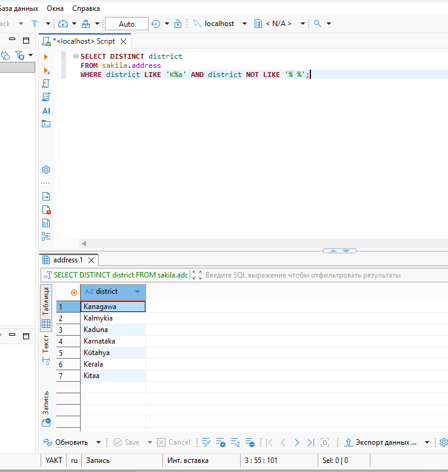
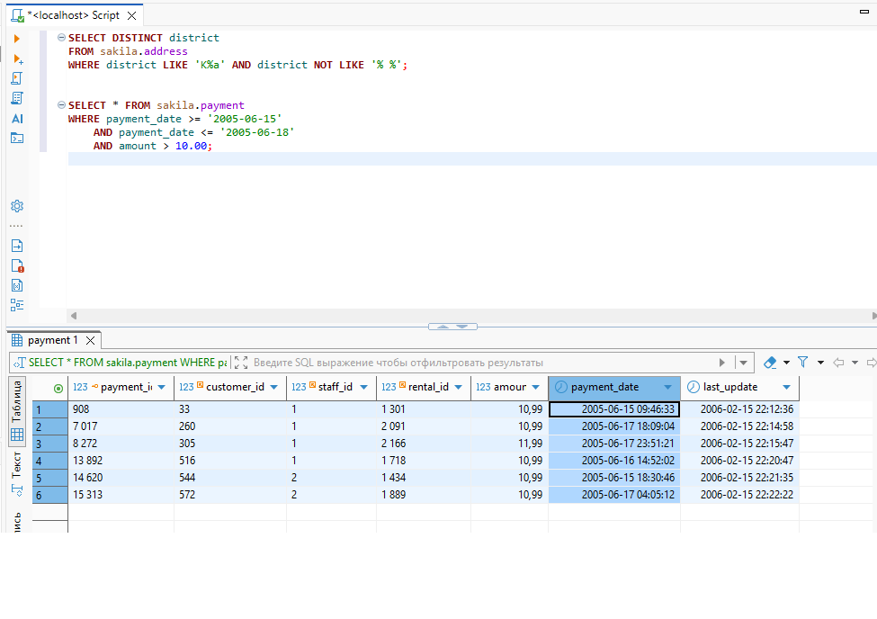
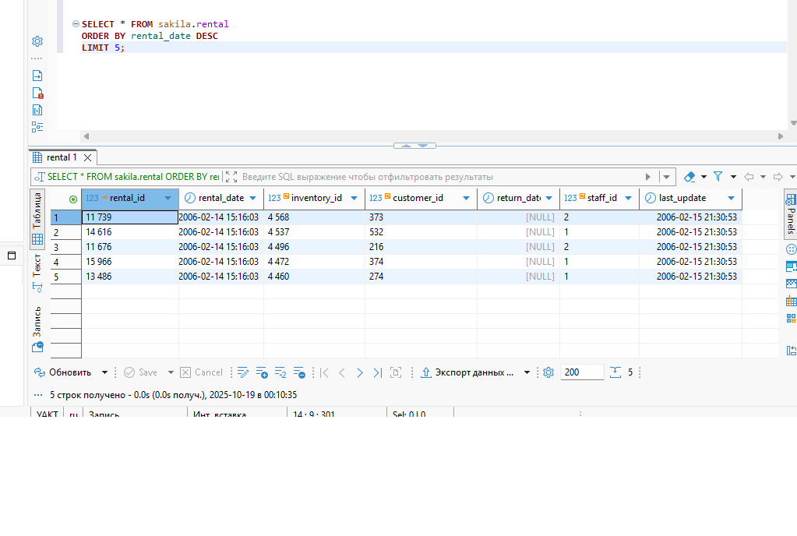
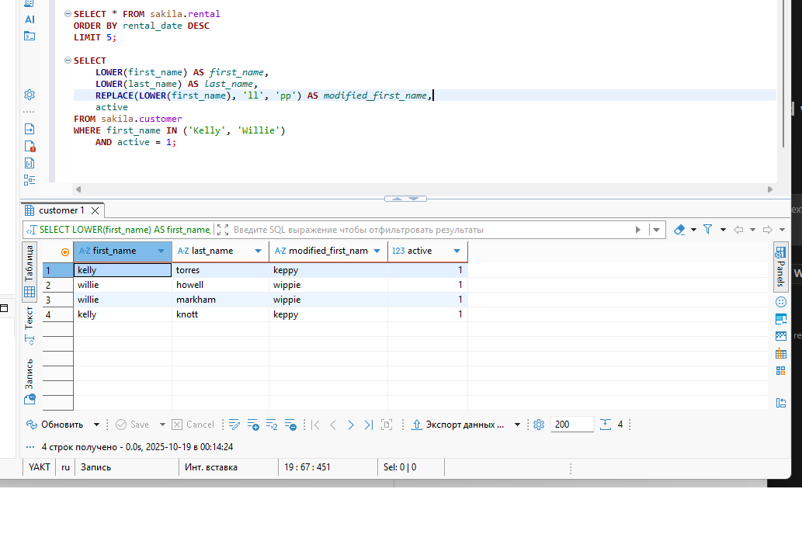

# Домашнее задание к занятию «SQL. Часть 1» Фастовец Александр

## Задание 1

Получите уникальные названия районов из таблицы с адресами, которые начинаются на “K” и заканчиваются на “a” и не содержат пробелов.

## Ответ 1

```

SELECT DISTINCT district
FROM sakila.address
WHERE district LIKE 'K%a' AND district NOT LIKE '% %';

```



## Задание 2

Получите из таблицы платежей за прокат фильмов информацию по платежам, которые выполнялись в промежуток с 15 июня 2005 года по 18 июня 2005 года включительно и стоимость которых превышает 10.00.

## Ответ 2

```

SELECT * FROM sakila.payment
WHERE payment_date >= '2005-06-15'
	AND payment_date <= '2005-06-18'
    AND amount > 10.00;

```



## Задание 3

Получите последние пять аренд фильмов.

## Ответ 3

```

SELECT * FROM sakila.rental
ORDER BY rental_date DESC
LIMIT 5;

```



## Задание 4

Одним запросом получите активных покупателей, имена которых Kelly или Willie.

Сформируйте вывод в результат таким образом:

    все буквы в фамилии и имени из верхнего регистра переведите в нижний регистр,
    замените буквы 'll' в именах на 'pp'.


## Ответ 4

Приводем к нижнему ренистру имена и фамилии с помощью

```

LOWER(first_name) AS first_name,
LOWER(last_name) AS last_name,

```

Заменим буквы ll на pp

```

REPLACE(LOWER(first_name), 'll', 'pp') AS modified_first_name,

```

В итоге получим следующий запрос

```

SELECT 
	LOWER(first_name) AS first_name,
    LOWER(last_name) AS last_name,
    REPLACE(LOWER(first_name), 'll', 'pp') AS modified_first_name,
    active
FROM sakila.customer
WHERE first_name IN ('Kelly', 'Willie')
	AND active = 1;

```

